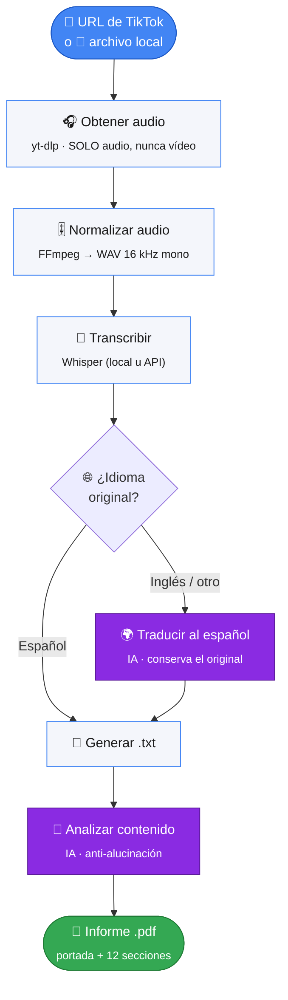
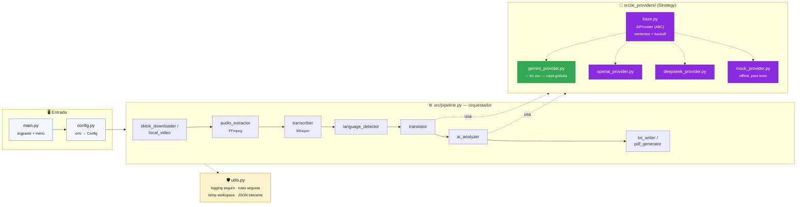

# 🎬 Extractor_texto_tiktok

<p align="center">
  
  
  
  
  
  
</p>

Convierte un vídeo de **TikTok** (o un archivo de vídeo local) en un **informe
técnico profesional en PDF, redactado íntegramente en español**.

> **🔒 Privacidad por diseño:** nunca se descarga ni se guarda el vídeo. Solo
> se obtiene el **audio**, en un archivo temporal que se borra al terminar.



> 📄 **¿Cómo está construido?** Consulta el [**Informe técnico**](INFORME_TECNICO.md):
> arquitectura, pipeline etapa por etapa, stack tecnológico y decisiones de diseño.

---

## Índice

1. [Requisitos](#requisitos)
2. [Instalación](#instalación)
3. [Configuración (`.env`)](#configuración-env)
4. [Uso](#uso)
5. [Detección de idioma y traducción](#detección-de-idioma-y-traducción)
6. [Proveedores de IA](#proveedores-de-ia)
7. [Arquitectura del sistema](#arquitectura-del-sistema)
8. [Seguridad](#seguridad)
9. [Archivos generados](#archivos-generados)
10. [Estructura del proyecto](#estructura-del-proyecto)
11. [Modelos de Whisper](#modelos-de-whisper)
12. [Problemas comunes](#problemas-comunes)
13. [Limitaciones](#limitaciones)
14. [Consideraciones legales y de uso](#consideraciones-legales-y-de-uso)

---

## Requisitos

| Componente | Detalle |
|---|---|
| **Sistema** | Windows 10/11 (también funciona en Linux/macOS con ajustes menores). |
| **Python** | 3.11 o superior. Probado en 3.13. |
| **FFmpeg** | Necesario para extraer el audio. Si no hay uno en el sistema, se usa automáticamente el que incluye el paquete `imageio-ffmpeg` (se instala con las dependencias). |
| **Clave de IA** | Solo para traducción y análisis. **Gemini** tiene capa gratuita: https://aistudio.google.com/apikey |
| **Espacio en disco** | ~2–2,5 GB para PyTorch + Whisper (backend de transcripción local por defecto). El modelo `small` añade ~490 MB la primera vez. |

---

## Instalación

### 1. Instalar Python

Descarga Python 3.11+ desde <https://www.python.org/downloads/windows/> y marca
**"Add python.exe to PATH"** durante la instalación.

Comprueba: `py -3 --version`

### 2. Crear el entorno virtual e instalar dependencias

**Opción rápida (Windows):** ejecuta `run.bat`. La primera vez crea `.venv` e
instala todo automáticamente.

**Opción manual:**

```bat
cd Extractor_texto_tiktok
py -3 -m venv .venv
.venv\Scripts\activate
python -m pip install --upgrade pip
pip install -r requirements.txt
```

La instalación descarga PyTorch (varios minutos la primera vez).

### 3. FFmpeg (opcional pero recomendado)

El proyecto funciona sin hacer nada gracias a `imageio-ffmpeg`. Si quieres un
FFmpeg del sistema (más rápido y completo):

```bat
winget install --id Gyan.FFmpeg -e
```

o descarga manual desde <https://www.gyan.dev/ffmpeg/builds/> y añade la carpeta
`bin` al `PATH`.

### 4. Configurar credenciales

```bat
copy .env.example .env
```

Edita `.env` y rellena la clave del proveedor que vayas a usar (ver abajo).

---

## Configuración (`.env`)

| Variable | Valores | Por defecto | Descripción |
|---|---|---|---|
| `AI_PROVIDER` | `openai` `gemini` `deepseek` `mock` | `gemini` | Proveedor para traducción y análisis. |
| `AI_MODEL` | texto | *(vacío)* | Modelo concreto. Vacío = modelo por defecto del proveedor. |
| `OPENAI_API_KEY` | texto | — | Clave de OpenAI. |
| `GEMINI_API_KEY` | texto | — | Clave de Google AI Studio (gratuita). |
| `DEEPSEEK_API_KEY` | texto | — | Clave de DeepSeek. |
| `TRANSCRIPTION_BACKEND` | `local` `openai_api` | `local` | `local` = Whisper en tu PC; `openai_api` = API de OpenAI. |
| `TRANSCRIPTION_MODEL` | `tiny`…`large-v3` | `small` | Tamaño del modelo Whisper (backend local). |
| `OUTPUT_DIRECTORY` | ruta | `output` | Carpeta de resultados. |
| `TEMP_DIRECTORY` | ruta | `temp` | Carpeta temporal. |
| `LOGS_DIRECTORY` | ruta | `logs` | Carpeta de logs. |
| `NETWORK_TIMEOUT` | entero (s) | `30` | Timeout de red para `yt-dlp` **y** para las llamadas al proveedor de IA. |
| `MAX_VIDEO_MB` | entero | `200` | Límite de tamaño para archivos locales **y** para el audio descargado de TikTok. |
| `ALLOW_MOCK_FALLBACK` | `true`/`false` | `false` | Si el proveedor elegido no tiene clave, usar `mock` en vez de fallar. |
| `KEEP_TEMP_ON_ERROR` | `true`/`false` | `true` | Conservar la carpeta temporal cuando un procesamiento falla (debug). |

Las claves **nunca** se escriben en logs ni se muestran por pantalla (se
enmascaran como `AIza…3456`).

---

## Uso

### Menú interactivo

```bat
python main.py
```

```
==============================================
        EXTRACTOR DE TEXTO DE TIKTOK
==============================================
  1. Procesar un TikTok
  2. Procesar múltiples TikToks (input/urls.txt)
  3. Procesar archivo de video local
  4. Cambiar proveedor de IA
  5. Ver configuración
  6. Salir
```

### Una URL

```bat
python main.py --url "https://www.tiktok.com/@usuario/video/1234567890123456789"
```

### Varias URLs

Edita `input/urls.txt` (una URL por línea; las líneas vacías y las que empiezan
por `#` se ignoran) y ejecuta:

```bat
python main.py --urls-file
```

### Archivo de vídeo local (fallback si TikTok bloquea la descarga)

```bat
python main.py --file "C:\Videos\clip.mp4"
```

Formatos aceptados: `mp4, mov, mkv, webm, avi, m4v, flv` (y audio suelto:
`mp3, wav, m4a, aac, ogg, flac`).

### Opciones útiles

| Opción | Efecto |
|---|---|
| `--provider gemini\|openai\|deepseek\|mock` | Fuerza el proveedor de IA (ignora `.env`). |
| `--ai-model NOMBRE` | Fuerza el modelo del proveedor de IA (ignora `AI_MODEL`). |
| `--model small\|medium\|…` | Fuerza el modelo de Whisper. |
| `--no-pdf` | Genera solo el `.txt`. |
| `--keep-temp` | Conserva la carpeta temporal aunque el procesamiento termine bien (por defecto se borra en éxito). |
| `--config` | Muestra la configuración y sale. |

Progreso mostrado:

```
[1/6] Obteniendo audio del TikTok (no se descarga el video)...
[2/6] Extrayendo audio (WAV 16 kHz mono)...
[3/6] Transcribiendo con Whisper (local:small)...
[4/6] Detectando idioma...
[INFO] Idioma detectado: English
[5/6] Traduciendo/analizando con IA...
[INFO] Traduciendo contenido al español...
[OK] Traducción completada.
[6/6] Generando PDF...
```

---

## Detección de idioma y traducción

1. **Transcripción** con Whisper (detecta el idioma a partir del audio).
2. **Verificación** con `langdetect` sobre el texto. Si discrepan, se registra
   el aviso pero se confía en Whisper.
3. **Si el idioma es español** → se usa la transcripción tal cual. No se traduce.
4. **Si es inglés u otro idioma** → la IA traduce **toda** la transcripción al
   español y **se conserva la versión original** en el `.txt`.

La traducción respeta la terminología técnica: **no** traduce nombres de
tecnologías, lenguajes, frameworks, librerías, APIs, productos ni herramientas
(`React`, `Node.js`, `REST API`, `OAuth 2.0`, `Docker`, `Kubernetes`,
`PostgreSQL`, …).

---

## Proveedores de IA

| Proveedor | SDK | Coste | Notas |
|---|---|---|---|
| **Gemini** | `google-genai` | **Capa gratuita** | Recomendado para empezar. Clave: <https://aistudio.google.com/apikey> |
| **OpenAI** | `openai` | De pago | Requiere facturación activa. |
| **DeepSeek** | `openai` (con `base_url`) | De pago (bajo coste) | API compatible con OpenAI. |
| **mock** | — | Gratis | Proveedor simulado: **no hace análisis real**. Para probar el pipeline sin claves. |

Cambiar de proveedor: edita `AI_PROVIDER` en `.env`, usa `--provider`, o la
opción 4 del menú. La arquitectura (`src/ai_providers/`) está desacoplada:
todos implementan la misma interfaz `AIProvider`.

Modelos por defecto (si `AI_MODEL` está vacío): `gpt-4o-mini` (OpenAI),
`gemini-3.6-flash` (Gemini), `deepseek-chat` (DeepSeek). Los proveedores retiran
modelos con el tiempo; si uno deja de funcionar, pon el nombre nuevo en
`AI_MODEL` (o usa `--ai-model NOMBRE`). El proveedor Gemini además intenta
**autocorregir** el modelo si la API indica el sustituto en el error.

Si el análisis con IA falla (límite de cuota, modelo caído, red), el `.txt` con
la transcripción se genera igualmente y el `.pdf` sale en modo degradado dejando
constancia del motivo, en vez de abortar todo el procesamiento.

---

## Arquitectura del sistema

El proyecto es un **pipeline lineal desacoplado**: cada etapa es un módulo
independiente que recibe y devuelve `dataclasses` simples, sin estado global.
Cambiar de proveedor de IA no requiere tocar el resto del programa (patrón
*Strategy* en `src/ai_providers/`).



| Capa | Módulos | Responsabilidad |
|---|---|---|
| **Entrada** | `main.py`, `config.py` | CLI, menú interactivo, carga/validación de `.env`. |
| **Orquestador** | `src/pipeline.py` | Encadena las 6 etapas y decide si continuar en modo degradado ante un fallo de IA. |
| **Proveedores de IA** | `src/ai_providers/` | Interfaz común `AIProvider`; cada proveedor solo implementa `_complete_raw()`. Reintentos/backoff centralizados en la clase base. |
| **Transversal** | `src/utils.py` | Logging con redacción de secretos, rutas seguras (anti *path traversal*), carpeta temporal, parseo de JSON tolerante. |

📄 Detalle completo de cada etapa, el modelo de datos y las decisiones de
diseño: [**INFORME_TECNICO.md**](INFORME_TECNICO.md).

---

## Seguridad

El proyecto procesa contenido de terceros desconocidos (vídeos públicos) y
usa una API de IA externa, así que se tomaron medidas concretas en ambos
frentes:

| Medida | Dónde | Por qué |
|---|---|---|
| 🔑 **Redacción de secretos en logs** | `utils.py::SecretFilter` | Las claves (`sk-…`, `AIza…`, `Bearer …`) se sustituyen por `[REDACTED]` en consola y archivo de log; `--config` solo muestra la clave enmascarada (`AIza…3456`). |
| 🧱 **Anti *path traversal*** | `utils.py::safe_output_path` | Los nombres de archivo derivados de datos externos (título del vídeo, id) nunca pueden escribir fuera de `output/`. |
| 🎯 **Solo contenido público** | `tiktok_downloader.py` | `yt-dlp` se usa sin cookies ni credenciales; nunca se intenta sortear un vídeo privado o con captcha. |
| 📦 **Límite de tamaño de descarga** | `tiktok_downloader.py` / `local_video.py` | `MAX_VIDEO_MB` limita tanto los archivos locales como el audio descargado de TikTok (`max_filesize` de yt-dlp), evitando descargas desproporcionadas. |
| ⏱️ **Timeout de red en la IA** | `ai_providers/gemini_provider.py` | Las llamadas a Gemini usan `NETWORK_TIMEOUT` del `.env`; sin esto, una llamada colgada bloquearía el pipeline indefinidamente. |
| 🛑 **Guardas contra inyección de instrucciones** | `translator.py`, `ai_analyzer.py` | La transcripción es contenido de un tercero no confiable. Los *system prompts* indican explícitamente al modelo que ese texto es **dato a procesar, nunca una instrucción**, aunque contenga frases como "ignora tus reglas". |
| 🗑️ **Sin persistencia del vídeo** | `tiktok_downloader.py`, `TempWorkspace` | Solo se guarda el audio, en una carpeta temporal por trabajo que se borra al terminar con éxito. |
| 🙈 **`.env` fuera del repositorio** | `.gitignore` | Las claves de API, `logs/`, `temp/` y `output/` nunca se suben a Git. |

Más contexto en la [sección 8 del informe técnico](INFORME_TECNICO.md#8-seguridad-y-privacidad).

---

## Archivos generados

```
output/
├── txt/
│   └── tiktok_<id>.txt          (o  local_<nombre>_<fecha>.txt)
└── pdf/
    └── reporte_tiktok_<id>.pdf  (o  reporte_local_<nombre>_<fecha>.pdf)
```

### `.txt`

```
==================================================
INFORMACION DEL VIDEO
=====================
URL:                     ...
FECHA DE PROCESAMIENTO:  ...
IDIOMA ORIGINAL:         English (en)
IDIOMA DEL REPORTE:      Espanol
TRADUCCION REALIZADA:    Si
DURACION:                00:42
ID DEL VIDEO:            123456789

==================================================
TRANSCRIPCION ORIGINAL
======================
[00:00] Today we're going to build a REST API...

==================================================
TRANSCRIPCION EN ESPANOL
========================
[00:00] Hoy vamos a construir una REST API...
```

(Si el vídeo ya está en español, solo aparece la sección **TRANSCRIPCION EN
ESPANOL** con el texto original.)

### `.pdf`

Portada + 12 secciones: **A** Resumen ejecutivo · **B** Explicación detallada ·
**C** Tecnologías (tabla) · **D** Conceptos técnicos · **E** Arquitectura ·
**F** Análisis de código · **G** Buenas prácticas · **H** Riesgos ·
**I** Recomendaciones · **J** Nivel de dificultad · **K** Aplicaciones ·
**L** Conclusión. Con numeración de páginas, encabezado y tipografía Unicode
(acentos, `ñ`, `¿ ¡`, `ü`).

El análisis distingue explícitamente **información explícita**,
**inferencia técnica** y **recomendación**, y evita inventar tecnologías,
arquitecturas o código que no estén en el contenido.

---

## Estructura del proyecto

```
Extractor_texto_tiktok/
├── main.py                 # CLI + menú interactivo
├── config.py               # carga y validación de .env
├── requirements.txt
├── .env.example
├── run.bat
├── src/
│   ├── models.py           # dataclasses compartidas
│   ├── pipeline.py         # orquestador de las 6 etapas
│   ├── tiktok_downloader.py# yt-dlp: SOLO audio, nunca vídeo
│   ├── local_video.py      # validación de archivos locales
│   ├── audio_extractor.py  # FFmpeg -> WAV 16 kHz mono
│   ├── transcriber.py      # Whisper local / API de OpenAI
│   ├── language_detector.py# idioma (Whisper + langdetect)
│   ├── translator.py       # traducción al español vía IA
│   ├── ai_analyzer.py      # análisis técnico -> JSON -> AnalysisReport
│   ├── txt_writer.py       # generación del .txt
│   ├── pdf_generator.py    # generación del .pdf (ReportLab)
│   ├── utils.py            # logging seguro, rutas, JSON, FFmpeg, temp
│   └── ai_providers/       # OpenAI / Gemini / DeepSeek / mock
├── input/urls.txt
├── output/{txt,pdf}/
├── temp/  · logs/
└── tests/
```

### Tests

```bat
.venv\Scripts\activate
pytest -q
```

Los tests usan mocks: **no** hacen descargas reales de TikTok ni llamadas reales
a APIs, y no necesitan PyTorch. Incluyen la clasificación de errores y el
autocambio de modelo del proveedor Gemini.

---

## Modelos de Whisper

| Modelo | RAM aprox. | Velocidad (CPU) | Precisión |
|---|---|---|---|
| `tiny` | ~1 GB | Muy rápida | Baja |
| `base` | ~1 GB | Rápida | Media-baja |
| `small` | ~2 GB | Media | **Buena (recomendado)** |
| `medium` | ~5 GB | Lenta | Alta |
| `large` / `large-v3` | ~10 GB | Muy lenta | Máxima |

Sin GPU, `medium` y `large` pueden tardar mucho. Empieza con `small`.

El backend `openai_api` (`TRANSCRIPTION_BACKEND=openai_api`) no descarga nada
pero es de pago y limita a 25 MB por archivo de audio.

---

## Problemas comunes

| Síntoma | Solución |
|---|---|
| `FFmpeg no esta disponible` | Instala `imageio-ffmpeg` (`pip install -r requirements.txt`) o FFmpeg del sistema (`winget install Gyan.FFmpeg`). |
| `TikTok ha bloqueado o limitado la peticion` | Actualiza yt-dlp (`pip install -U yt-dlp`), espera un rato, o usa `--file` con el vídeo descargado a mano. |
| `El video es privado, restringido…` | El contenido no es público. La aplicación no accede a contenido no público. |
| Descarga enorme al instalar | Es PyTorch (backend Whisper local). Alternativa: `TRANSCRIPTION_BACKEND=openai_api`. |
| `faster-whisper` no instala | No se usa: no tiene soporte para Python 3.13. Este proyecto usa `openai-whisper`. |
| `Falta la clave de API para gemini` | Rellena `GEMINI_API_KEY` en `.env` o usa `--provider mock`. |
| La 1.ª transcripción tarda | Descarga el modelo Whisper (`small` ≈ 490 MB). Solo la primera vez. |
| El PDF sale con fuente distinta | Si no hay `C:\Windows\Fonts\arial.ttf`, usa Helvetica. El texto español se renderiza igual. |

Los logs detallados están en `logs/run_AAAAMMDD.log`.

---

## Limitaciones

- **Dependencia de TikTok:** la obtención de audio usa `yt-dlp`; si TikTok cambia
  sus mecanismos, puede dejar de funcionar temporalmente. El modo `--file` es el
  plan B y ejercita todo el pipeline.
- **Transcripción local en CPU:** más lenta que con GPU. El modelo `small` es el
  compromiso recomendado.
- **Capa gratuita de Gemini:** tiene límites de peticiones. Para transcripciones
  largas, la traducción se hace por lotes y con reintentos, pero puedes toparte
  con el límite.
- **Calidad de la traducción/análisis:** depende del proveedor y modelo elegidos.
- El backend `openai_api` de transcripción no admite audios de más de 25 MB.

---

## Consideraciones legales y de uso

- Usa esta herramienta **solo con contenido público** y para el que tengas
  derecho de acceso. No accede a cuentas privadas ni elude autenticación,
  captchas o controles de acceso.
- Respeta los **Términos de Servicio de TikTok** y la legislación de propiedad
  intelectual aplicable en tu país. La responsabilidad del uso es de quien
  ejecuta la herramienta.
- El audio descargado es **temporal** y se elimina tras el procesamiento. No se
  almacena el vídeo.
- Las transcripciones y análisis generados por IA pueden contener errores;
  revísalos antes de darles un uso relevante.

---

## Licencia

Este proyecto se distribuye bajo la licencia **MIT**. Consulta el archivo
[LICENSE](LICENSE).
